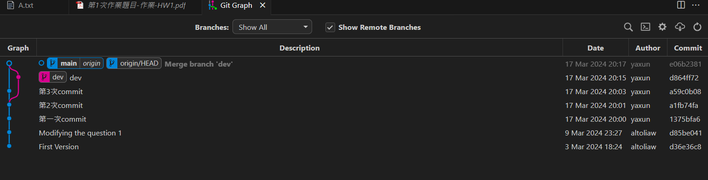
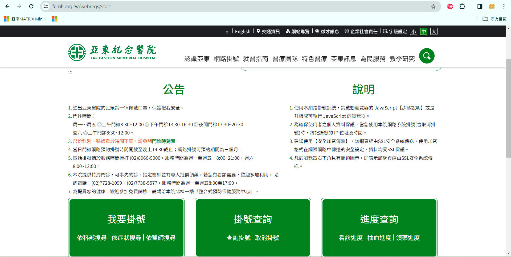
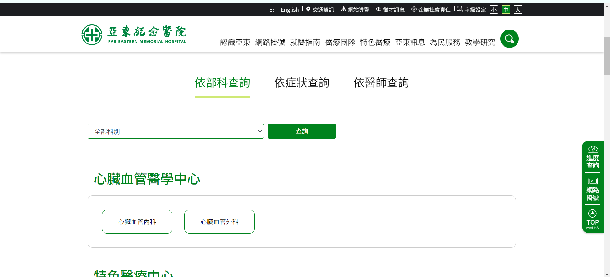
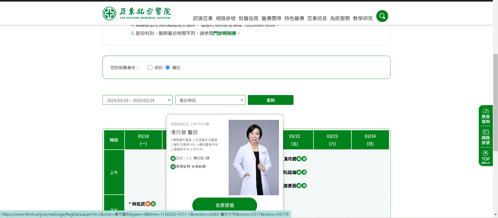
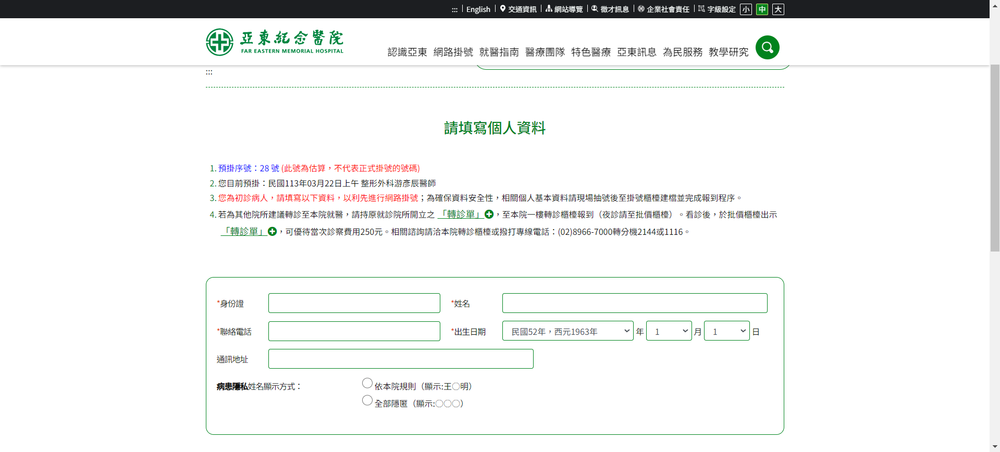
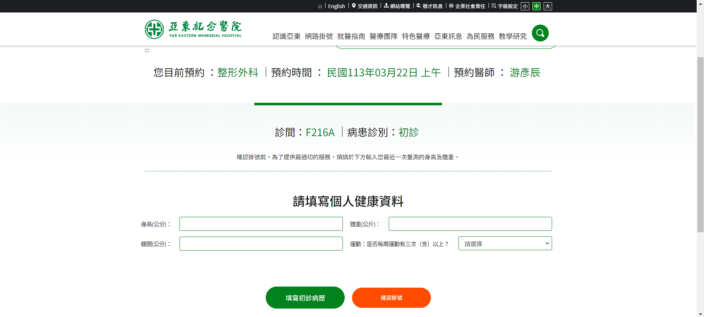
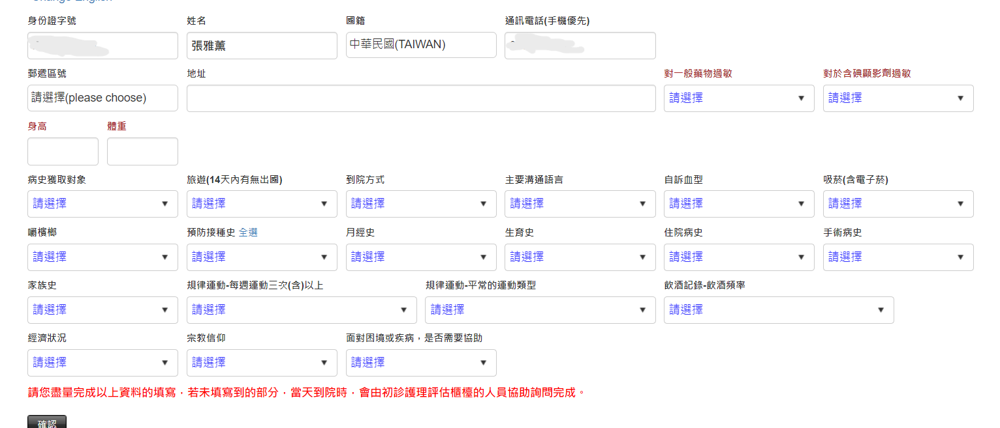
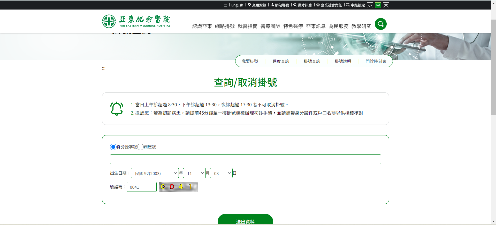
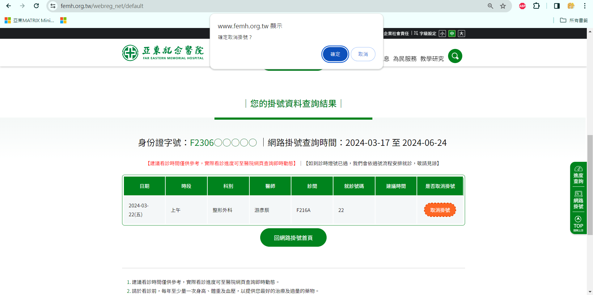

# 第1次作業-作業-HW1
>
>學號：111111109
><br />
>姓名：張雅薰
><br />
>作業撰寫時間：40 (mins，包含程式撰寫時間)
><br />
>最後撰寫文件日期：2024/03/17
>

本份文件包含以下主題：(至少需下面兩項，若是有多者可以自行新增)
- [x] 說明內容
- [x] 個人認為完成作業須具備觀念

## 說明程式與內容
作業一<br />
1.fork老師的倉庫並clone
```git
git clone
```
2.新增檔案A.txt，並輸入「This is an apple.」<br />
3.add、commit、push到伺服器倉庫<br />
4.再打開A.txt，並在「This is an apple.」後插入一個「Enter」後，再插入5列「This is a bear.」<br />
5.add、commit、push到伺服器倉庫<br />
6.在「This is an apple.」後插入一個「Enter」後，再插入5列「This is a cake.」，並將第一列的「This is an apple.」刪除<br />
7.add、commit、push到伺服器倉庫<br />
8.切換到第5步的commit編號
```git
git checkout a1fb74fa
```
9.新增分支"dev"，並切換到該分支
```git
git branch dev
git checkout dev
```
10.修改"dev"分支的A.txt內容
11.切換回main
```git
git checkout main
```
12.合併分支、add、commit、push到伺服器倉庫
```git
git merge dev
```
git graph的線圖

作業二
1.開啟亞東醫院掛號系統

2.選擇科部

3.選擇掛號日期與醫師

4.填寫個人資料

5.填寫個人健康資料

6.因為是初診，所以需要填寫初診病歷

7.掛號成功

8.取消掛號

9.取消成功



## 個人認為完成作業須具備觀念
學習git的使用，以及分支的使用，例如:合併如何處理衝突。<br />
了解流程的重要性、如何讓使用者清楚的操作使用。